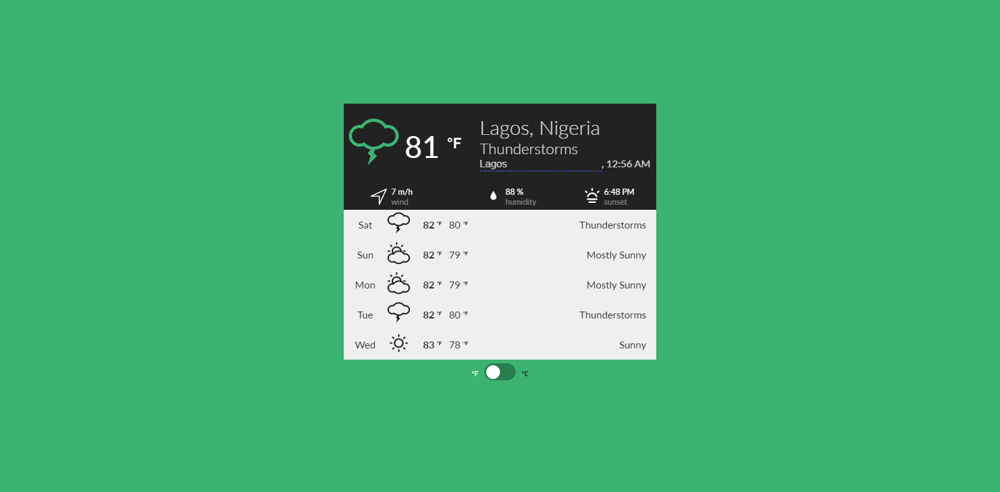

# Eazy React Weather App 

A simple weather app built using React JS's [Create React App](https://github.com/facebook/create-react-app), and uses [Redux-Saga](https://github.com/redux-saga/redux-saga/) for application's state management, it displays weather information from [Yahoo Weather API](https://developer.yahoo.com/weather).

### Credits

-  Logo/Favicon Icon made by [Good Ware](https://www.flaticon.com/authors/good-ware)
- [Show the Local Weather (in React)](https://codepen.io/anneklapwijk/pen/BKYXNJ)
- [Meteocons Weather Icons](http://www.alessioatzeni.com/meteocons/)

This project was bootstrapped with [Create React App](https://github.com/facebook/create-react-app).
